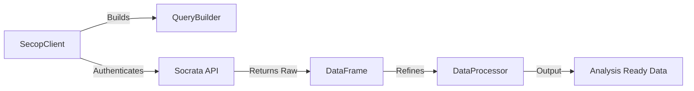

# pysecop 🇨🇴

[](https://www.python.org/downloads/)
[](https://opensource.org/licenses/MIT)

**pysecop** is a high-performance Python package designed to interact seamlessly with Colombia's Public Procurement Data (SECOP I & II). 

It abstracts the complexity of the Socrata (SODA) API, handles messy government data cleaning, and provides a fluent interface for building complex queries that are ready for Machine Learning and Big Data pipelines.

---

## 🚀 Why pysecop?

Public procurement data is the foundation of transparency and market intelligence. However, raw government APIs often return inconsistent formats, "polluted" URL strings, and fragmented schemas. `pysecop` solves this by providing:

-   🏗️ **Fluent SoQL Builder**: Build complex Socrata queries without writing a single line of raw SQL.
-   🧹 **Automated Data Hygiene**: Pre-configured processors for dates, URLs, and categorical encoding.
-   🔗 **Unified Schema**: High-level methods to join data across SECOP I and SECOP II seamlessly.
-   🐳 **Production Ready**: Fully Dockerized and tested for mission-critical ETL environments.

---

## 🛠️ Quick Start

### Installation

```bash
pip install pysecop
```

### Basic Fetching

```python
from pysecop import SecopClient, QueryBuilder

client = SecopClient()
qb = QueryBuilder()

# Find the top 5 largest contracts in SECOP II
qb.select(["id_contrato", "valor_del_contrato", "nombre_entidad"]) \
  .order("valor_del_contrato", "DESC") \
  .limit(5)

df = client.fetch("SECOP_II", qb)
print(df.head())
```

---

## 🏛️ Project Architecture

The system follows a modular design to ensure scalability and ease of maintenance:



For a deeper dive into the system design, check out the [Architecture Deep Dive](docs/ARCHITECTURE.md).

---

## 📂 Documentation Layers

-   **[ARCHITECTURE.md](docs/ARCHITECTURE.md)**: Technical design, data flow, and architectural trade-offs.
-   **[GUIDE.md](docs/GUIDE.md)**: Full API reference, installation, and extension guide.
-   **[USE_CASES.md](docs/USE_CASES.md)**: Business value, anti-corruption use cases, and market intelligence examples.

---

## 📄 License

This project is licensed under the MIT License - see the LICENSE file for details.