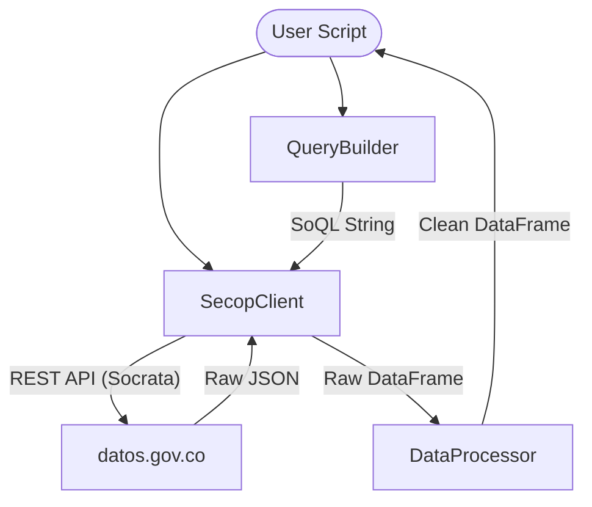

# System Architecture: pysecop

`pysecop` is designed as a modular, lightweight wrapper around the Colombian SECOP (Socrata) API. It bridges the gap between raw government data and ready-to-use analytical datasets.

## Core Philosophical Principles

1.  **Separation of Concerns**: Querying logic (`QueryBuilder`) is decoupled from API interaction (`SecopClient`), which is decoupled from data transformation (`DataProcessor`).
2.  **Configuration over Code**: Dataset specifics (IDs, column mappings) are centralized in `config.py`, making the system easily extensible without logic changes.
3.  **Analytics-First**: Output is natively in `pandas.DataFrame` format with industry-standard cleaning applied (dates, URLs, categorical mapping).

## High-Level Architecture

## Component Breakdown

### 1. `SecopClient` (The Communicator)
Responsible for maintaining the connection to Socrata. It abstracts the authentication (via App Tokens) and the HTTP request lifecycle. It supports both raw SoQL strings and the fluent `QueryBuilder`.

### 2. `QueryBuilder` (The Translator)
Implements a fluent interface to construct **SoQL (Socrata Query Language)**. 
- **Why?** Writing raw SoQL is error-prone. The `QueryBuilder` ensures correct syntax for `WHERE IN`, `LIMIT`, and `OFFSET` clauses, acting as a mini-ORM for public data.

### 3. `DataProcessor` (The Refiner)
A stateless utility class that cleans the idiosyncratic data formats found in government records.
- **Date Normalization**: Converts various ISO and Spanish date strings to standard Python `datetime`.
- **URL Extraction**: Robust regex-based cleaning for Socrata's "nested JSON" URL strings.
- **Categorical Encoding**: Maps "Si/No" and "True/False" to binary integers for easier ML ingestion.

## Data Flow Lifecycle

1.  **Request**: User defines filters using `QueryBuilder`.
2.  **Execution**: `SecopClient` sends the SoQL to the appropriate Socrata endpoint (SECOP I or II).
3.  **Ingestion**: Results are converted from JSON to a `pandas` DataFrame immediately.
4.  **Cleaning**: `DataProcessor` identifies columns in the `config` and applies specific hygiene rules.
5.  **Delivery**: A analysis-ready DataFrame is returned.

## Design Decisions

-   **Why Pandas?** Given the target audience (Data & AI Engineers), `pandas` is the lingua franca. Utilizing it for the internal representation allows for seamless integration with Scikit-learn, PyTorch, or visualization libraries.
-   **Why Socrata?** SECOP provides various export formats, but the SODA API (Socrata) is the most reliable for programmatic access and incremental updates.
-   **Stateless Processing**: The `DataProcessor` doesn't store state, making it thread-safe and easy to test in isolation.
