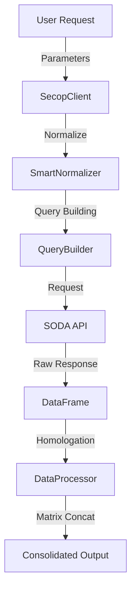

# Architecture Deep Dive: pysecop 1.2.0

`pysecop` is designed as a high-performance orchestration layer between Python data stacks (Pandas/Numpy) and the Socrata (SODA) Open Data API. 

## 🏗️ Core Layers

### 1. Intelligent Input Normalizer (`SmartNormalizer`)
The normalizer provides **Input Resilience** by ensuring that user-provided filters (like NITs, IDs, and Dates) match the specific backend data types required by the SODA API for each dataset.
- **NIT Cleaning**: Automatically strips non-numeric characters for fields marked as `numeric` in `config.py`.
- **Date Parsers**: Consistently formats various date formats into ISO standard ISO strings for API compatibility.
- **Type Casting**: Prevents `400 Client Error: Bad Request` by avoiding quotes for numeric fields in SoQL queries.

### 2. SODA Query Engine (`QueryBuilder`)
A fluent SoQL builder that abstracts the string construction for Socrata queries. 
- **Default Selection**: Standardizes on `SELECT *` for universal data preservation unless specific columns are requested.
- **Filter Translation**: Automatically maps unified frontend field names back to source-specific backend field names.

### 3. "Matrix-in-Blocks" Consolidation
The search engine consolidates data from multiple SECOP versions into a single, comprehensive DataFrame using a "Deep Union" strategy.
- **Standardization**: Common concepts (e.g., `nit_entidad` and `nit_de_la_entidad`) are merged into a single, standardized column based on the **SECOP II Schema**.
- **Data Preservation**: Fields that are unique to a specific source (like the SECOP I `uid`) are **strictly preserved** in the final result.
- **Sparse Alignment**: Correctly aligns disparate schemas into a single matrix, using `NaN` for fields that are not applicable to a specific record's source.

## 🔗 Data Flow

```mermaid
graph TD
    A[User Request] -->|Parameters| B[SecopClient]
    B -->|Normalize| C[SmartNormalizer]
    C -->|Query Building| D[QueryBuilder]
    D -->|Request| E[SODA API]
    E -->|Raw Response| F[DataFrame]
    F -->|Homologation| G[DataProcessor]
    G -->|Matrix Concat| H[Consolidated Output]
```

## 🛠️ Configuration and Metadata
The system's behavior is driven by [**`config.py`**](file:///pysecop/data/config.py), which defines:
- **`DatasetConfig`**: Metadata for each dataset, including column types and source URLs.
- **`COLUMN_MAPPING`**: The translation layer between SECOP I and SECOP II fields.

This configuration-driven approach allows for adding new resources or SECOP datasets without changing the core or orchestrator logic.
